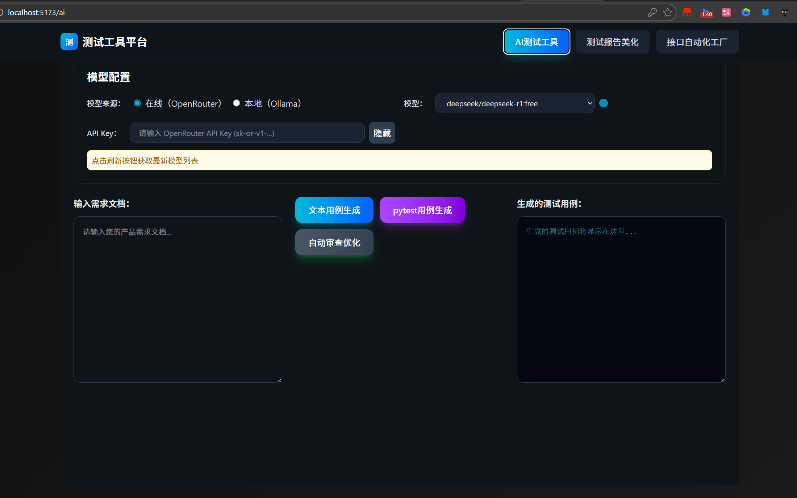
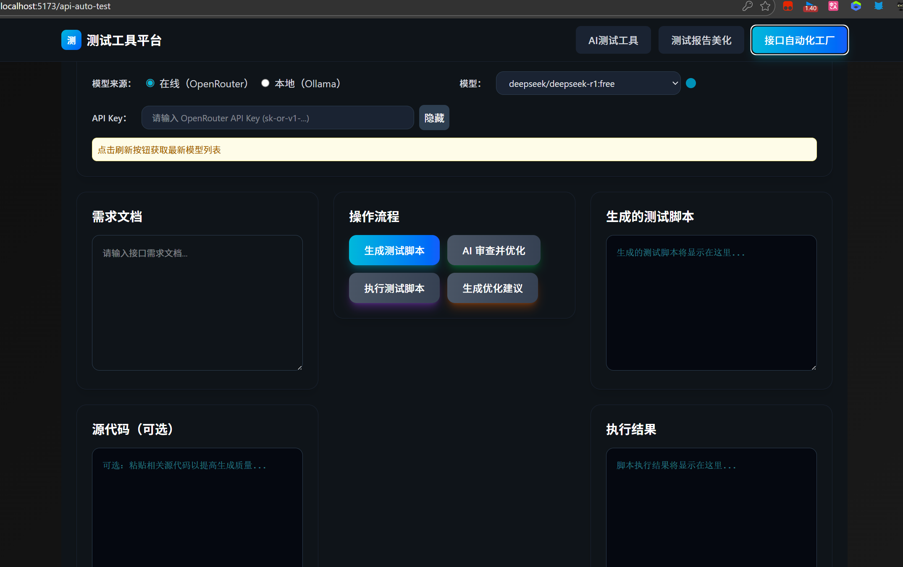
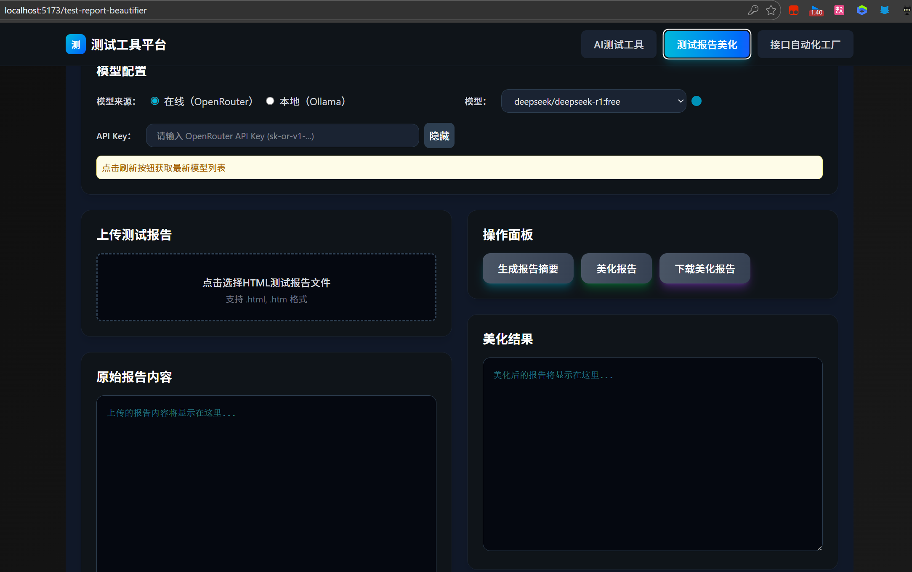

# AI_TEST - 测试工具流水线工厂

[](https://github.com/RichardLitt/standard-readme)

> 一个基于 AI 的测试自动化平台，让测试工作更智能、更高效。





## 简介

测试工具流水线工厂是一个集成了人工智能技术的测试自动化平台，专为测试人员设计。它能够帮助你自动生成测试用例、美化测试报告，以及快速创建和执行接口自动化测试脚本。无论你是手动测试人员还是自动化测试工程师，这个工具都能显著提升你的工作效率。

**核心功能：**
- 🤖 **AI 测试用例生成** - 输入需求描述，AI 自动生成完整的测试用例
- 📊 **测试报告美化** - 将简陋的测试报告转换为专业、美观的可视化报告
- 🔄 **接口自动化工厂** - 零代码生成接口测试脚本，支持一键执行

**技术亮点：**
- 支持 OpenAI GPT 模型和本地 Ollama 大模型
- 基于 FastAPI + Vue 3 的现代化架构
- 完全容器化，一键部署
- 深色主题 UI，灵感来自 Speedtest

## 目录

- [背景](#背景)
- [安装](#安装)
- [使用](#使用)
- [API](#api)
- [技术栈](#技术栈)
- [部署](#部署)
- [维护者](#维护者)
- [如何贡献](#如何贡献)
- [许可证](#许可证)

## 背景

作为测试人员，你是否遇到过这些问题：

- 📝 手写测试用例耗时耗力，重复劳动太多？
- 📊 测试报告格式单调，不够直观美观？
- 🔧 接口自动化测试需要写大量代码，门槛太高？
- 🤖 想用 AI 提升效率，但不知道从何下手？

**测试工具流水线工厂**就是为了解决这些痛点而生。它将 AI 技术与测试工作深度结合，让测试人员无需编写复杂代码，就能享受自动化和智能化带来的效率提升。

这个项目的灵感来自于实际的测试工作需求。在日常的测试工作中，我们发现大量的重复性工作可以通过工具化和 AI 化来解决。于是我们构建了这个平台，希望能让更多测试人员从繁琐的手工劳动中解放出来，专注于更有价值的测试分析和质量把控。

**为什么选择这个工具？**

- ✅ **零学习成本** - 无需学习编程，会用浏览器就能上手
- ✅ **AI 加持** - 支持 OpenAI 和本地 Ollama，智能生成测试内容
- ✅ **开箱即用** - Docker 一键部署，5 分钟内启动运行
- ✅ **完全开源** - 代码透明，可自由定制和扩展

## 安装

本项目支持两种安装方式：Docker 部署（推荐）和本地开发模式。

### 方式一：Docker 部署（推荐）

这是最快速的启动方式，适合生产环境和快速体验。

**前置要求：**
- Docker 20.10+
- Docker Compose 1.29+

**步骤：**

```bash
# 1. 克隆项目
git clone https://github.com/DSGWJQ/AI_TEST.git
cd AI_TEST

# 2. 配置环境变量
cp .env.example .env
# 编辑 .env 文件，填入你的 API 密钥

# 3. 启动所有服务
docker-compose up -d

# 4. 访问应用
# 前端：http://localhost:8080
# 后端：http://localhost:8000
```

就这么简单！🎉

### 方式二：本地开发模式

适合需要修改代码或深度定制的开发者。

**前置要求：**
- Python 3.12+
- Node.js 18+
- npm 或 pnpm

**后端启动：**

```bash
# 1. 进入项目目录
cd AI_TEST

# 2. 创建虚拟环境
python -m venv .venv
source .venv/bin/activate  # Linux/Mac
# 或 .\.venv\Scripts\activate  # Windows

# 3. 安装依赖
pip install -r backend/requirements.txt

# 4. 启动后端服务
uvicorn backend.main:app --reload --host 0.0.0.0 --port 8000
```

**前端启动：**

```bash
# 1. 进入前端目录
cd frontend-new

# 2. 安装依赖
npm install

# 3. 启动开发服务器
npm run dev
```

**配置说明：**

编辑项目根目录的 `.env` 文件：

```env
# OpenAI API Key（如果使用 OpenAI）
VITE_OPENROUTER_API_KEY=sk-xxxxx

# Ollama 本地服务地址（如果使用本地模型）
VITE_OLLAMA_URL=http://localhost:11434/v1
```

## 使用

### 快速开始

启动服务后，打开浏览器访问 `http://localhost:5173`（本地开发）或 `http://localhost:8080`（Docker 部署），你会看到主页面。

### 功能一：AI 测试用例生成

1. 点击导航栏的 **"AI测试工具"**
2. 在文本框中输入你的需求描述，例如：

   ```
   需求：用户登录功能
   说明：用户可以通过手机号和密码登录系统
   ```

3. 选择 AI 模型（OpenAI 或本地 Ollama）
4. 点击 **"生成测试用例"** 按钮
5. AI 会自动生成完整的测试用例，包括：
   - 测试场景
   - 前置条件
   - 测试步骤
   - 预期结果
6. 你可以导出测试用例为 Excel 或 Markdown 格式

### 功能二：测试报告美化

1. 点击导航栏的 **"测试报告美化"**
2. 上传你的测试报告文件（支持 txt、json、xml 等格式）
3. 点击 **"美化报告"**
4. 系统会生成美观的可视化报告，包括：
   - 测试通过率图表
   - 失败用例详情
   - 性能统计
5. 支持导出为 HTML 或 PDF

### 功能三：接口自动化工厂

1. 点击导航栏的 **"接口自动化工厂"**
2. 填写接口信息：
   - 接口地址：`https://api.example.com/login`
   - 请求方法：POST
   - 请求参数：`{"username": "test", "password": "123456"}`
3. 点击 **"生成测试脚本"**
4. AI 会自动生成 Python 测试脚本
5. 点击 **"运行测试"** 立即执行
6. 查看测试结果和详细日志

### 命令行示例

如果你更喜欢命令行操作，可以直接调用 API：

```bash
# 生成测试用例
curl -X POST http://localhost:8000/api/generate-testcase \
  -H "Content-Type: application/json" \
  -d '{"requirement": "用户登录功能", "model": "gpt-4"}'

# 美化测试报告
curl -X POST http://localhost:8000/api/beautify-report \
  -F "file=@test_report.txt"

# 生成接口测试脚本
curl -X POST http://localhost:8000/api/generate-api-test \
  -H "Content-Type: application/json" \
  -d '{"url": "https://api.example.com/login", "method": "POST"}'
```

## API

本项目后端基于 FastAPI 构建，提供 RESTful API 接口。完整的 API 文档可以在启动后端服务后访问：

```
http://localhost:8000/docs
```

### 主要 API 端点

#### 1. 生成测试用例

```http
POST /api/generate-testcase
Content-Type: application/json

{
  "requirement": "用户登录功能描述",
  "model": "gpt-4",
  "temperature": 0.7
}
```

**响应示例：**

```json
{
  "code": 200,
  "msg": "success",
  "data": {
    "testcases": [
      {
        "title": "测试正常登录",
        "precondition": "用户已注册",
        "steps": ["打开登录页面", "输入正确的用户名和密码", "点击登录"],
        "expected": "登录成功，跳转到首页"
      }
    ]
  }
}
```

#### 2. 美化测试报告

```http
POST /api/beautify-report
Content-Type: multipart/form-data

file: <测试报告文件>
```

#### 3. 生成接口测试脚本

```http
POST /api/generate-api-test
Content-Type: application/json

{
  "url": "https://api.example.com/login",
  "method": "POST",
  "params": {"username": "test", "password": "123456"}
}
```

更多详细的 API 文档，请参考 [API 文档](http://localhost:8000/docs)。

## 技术栈

### 后端
- **[FastAPI](https://fastapi.tiangolo.com/)** - 现代、高性能的 Python Web 框架
- **[Python 3.12+](https://www.python.org/)** - 最新的 Python 版本
- **[Uvicorn](https://www.uvicorn.org/)** - ASGI 服务器
- **[Pydantic](https://pydantic-docs.helpmanual.io/)** - 数据验证

### 前端
- **[Vue 3](https://vuejs.org/)** - 渐进式 JavaScript 框架
- **[Vite](https://vitejs.dev/)** - 极速的前端构建工具
- **[Tailwind CSS v4](https://tailwindcss.com/)** - 实用优先的 CSS 框架
- **[Vue Router](https://router.vuejs.org/)** - Vue 官方路由管理器
- **[Axios](https://axios-http.com/)** - HTTP 客户端

### AI 集成
- **[OpenAI API](https://platform.openai.com/)** - GPT 模型接入
- **[Ollama](https://ollama.ai/)** - 本地大模型运行环境

### 部署
- **[Docker](https://www.docker.com/)** - 容器化平台
- **[Docker Compose](https://docs.docker.com/compose/)** - 多容器编排
- **[Nginx](https://www.nginx.com/)** - 高性能 Web 服务器

## 部署

### Docker Compose 部署（生产环境推荐）

项目包含完整的 Docker 配置，可一键部署到生产环境：

```bash
# 克隆项目
git clone https://github.com/DSGWJQ/AI_TEST.git
cd AI_TEST

# 配置环境变量
cp .env.example .env
vim .env  # 编辑配置

# 启动服务
docker-compose up -d

# 查看日志
docker-compose logs -f

# 停止服务
docker-compose down
```

### 手动 Docker 部署

如果你想手动构建和运行容器：

```bash
# 构建前端镜像
docker build -t first-mix-web -f frontend-new/Dockerfile frontend-new

# 构建后端镜像
docker build -t first-mix-api -f backend/Dockerfile backend

# 运行前端
docker run -d -p 8080:80 --name web first-mix-web

# 运行后端
docker run -d -p 8000:8000 --name api first-mix-api
```

## 项目结构

```
AI_TEST/
├── backend/                    # 后端 FastAPI 服务
│   ├── app/                   # 核心业务模块
│   │   ├── sanitizer.py       # 输入清洗与安全验证
│   │   └── script_executor.py # 测试脚本执行器
│   ├── main.py               # FastAPI 应用入口
│   ├── requirements.txt      # Python 依赖
│   └── Dockerfile            # 后端容器配置
├── frontend-new/             # 前端 Vue 3 项目
│   ├── src/
│   │   ├── views/           # 页面组件
│   │   │   ├── Home.vue              # 首页
│   │   │   ├── ai_Test_case.vue      # AI 测试用例生成
│   │   │   ├── TestReportBeautifier.vue  # 测试报告美化
│   │   │   └── ApiAutoTestRunner.vue     # 接口自动化工厂
│   │   ├── components/      # 通用组件
│   │   │   └── NavBar.vue   # 导航栏
│   │   ├── router/          # 路由配置
│   │   ├── api/             # API 接口封装
│   │   └── main.js          # 应用入口
│   ├── vite.config.js       # Vite 配置
│   ├── tailwind.config.js   # Tailwind CSS 配置
│   └── package.json         # 前端依赖
├── docker-compose.yml        # Docker 编排配置
├── .env.example             # 环境变量模板
└── README.md               # 项目文档
```

## 维护者

[@DSGWJQ](https://github.com/DSGWJQ)

## 如何贡献

非常欢迎你的加入！无论是报告 Bug、提出新功能建议，还是提交代码改进。

**贡献步骤：**

1. Fork 本仓库
2. 创建你的特性分支 (`git checkout -b feature/AmazingFeature`)
3. 提交你的改动 (`git commit -m 'Add some AmazingFeature'`)
4. 推送到分支 (`git push origin feature/AmazingFeature`)
5. 打开一个 Pull Request

**贡献指南：**

- 提交代码前请先运行测试，确保所有测试通过
- 遵循项目现有的代码风格
- 为新功能添加测试用例
- 更新相关文档

提交 Pull Request 前，请确保：

- [ ] 代码符合项目规范
- [ ] 添加了必要的测试
- [ ] 更新了相关文档
- [ ] 所有测试通过

## 常见问题

### 1. AI 模型响应很慢怎么办？

- 如果使用 OpenAI API，可能是网络问题，建议配置代理
- 建议使用本地 Ollama 模型，响应速度更快
- 可以在模型配置中降低 temperature 参数

### 2. Docker 部署失败？

- 检查 Docker 和 Docker Compose 版本是否满足要求
- 确保 8000 和 8080 端口没有被占用
- 查看日志：`docker-compose logs -f`

### 3. 如何更换 AI 模型？

编辑 `.env` 文件，修改模型配置：

```env
# 使用 OpenAI
VITE_OPENROUTER_API_KEY=your-api-key

# 使用本地 Ollama
VITE_OLLAMA_URL=http://localhost:11434/v1
```

## 相关项目

- [Standard README](https://github.com/RichardLitt/standard-readme) - README 规范
- [Art of README](https://github.com/hackergrrl/art-of-readme) - README 编写艺术

## 许可证

[MIT](LICENSE) © DSGWJQ

---

**Made with ❤️ by the Testing Community**

如果这个项目对你有帮助，请给个 ⭐️ Star 支持一下！

有任何问题或建议？欢迎[提交 Issue](https://github.com/DSGWJQ/AI_TEST/issues/new)！